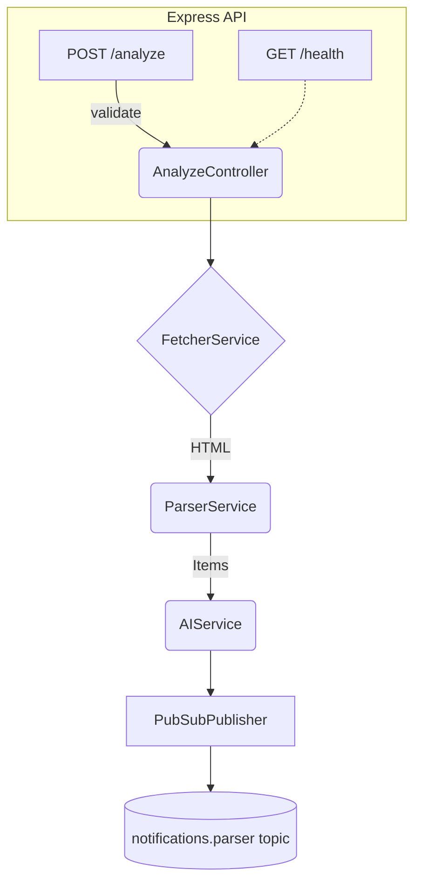

# Configurable Parser Service – Implementation Plan

## 1. Objectives

1. Provide a **generic parser micro-service** that replicates the behaviour of `boe-parser` while allowing **end-users to register arbitrary web pages (URLs) and prompt queries**.
2. Offer **robust error handling & observability** so that failures (network errors, parsing errors, AI errors, etc.) are surfaced back to the user and to the monitoring stack.
3. Keep the footprint small – reuse existing shared utilities, middleware, logging, Pub/Sub schemas and AI helpers to honour the _minimal-changes_ principle.
4. Serve as the first step towards a full end-to-end configurable subscription flow (DB changes & subscription-worker updates will be handled in later tasks).

---

## 2. Current Baseline (boe-parser)

`boe-parser` key flow (simplified):

1. **Controller (`src/controllers/analyze.js`)**
   * Accepts `{ texts, subscription_id, user_id, date, metadata }`.
   * Generates `traceId` & logs request.
   * Calls **`parseBOE`** → scrapes BOE bulletin, returns `{ boeContent, prompts }`.
   * Calls **`analyzeBOEItems`** (Gemini) per prompt.
   * Publishes a structured result to **Pub/Sub** and replies HTTP 200 JSON.
2. **Middleware** – validation, auth, error handler.
3. **Services** – `parser/` (scraping), `ai/` (LLM analysis).
4. **Utils** – `pubsub.js`, logging, date utilities.
5. **Scheduler** – outside (subscription-worker) triggers `POST /analyze` daily.

---

## 3. High-Level Requirements for the New Service

| Category | Requirement |
| -------- | ----------- |
| Input | Users can create a **subscription** consisting of: `url`, optional `cssSelector`/`xpath`, `frequency` (daily/weekly/hourly), and an array of `promptQueries`. |
| Processing | On schedule, fetch the URL, extract text/HTML, and run prompts through AI analysis. |
| Output | Publish results to existing `notifications.parser` Pub/Sub topic with the same envelope used by `boe-parser` so downstream workers remain untouched. |
| Error Handling | Return meaningful HTTP errors; publish an `error` event to Pub/Sub and store failure status for the subscription. |
| Config | Must load runtime secrets (API keys, Pub/Sub topic, etc.) via Cloud Run runtime variables / Secret Manager (same pattern as other services). |
| Extensibility | Easy to plug custom extractors (RSS, JSON API, HTML) via Strategy interface. |

---

## 4. Proposed Architecture



### Components / Responsibilities

1. **FetcherService** – HTTP GET with retries, timeout, user-agent spoofing and optional caching headers (ETag, Last-Modified).
2. **ParserService** – Strategy pattern (`HTMLStrategy`, `RSSStrategy`, `JSONStrategy`). Returns a list of *items* `{ id, title, content, date }`.
3. **AIService** – Thin wrapper over existing `services/ai` (Gemini/OpenAI) to run `promptQueries` against each item.
4. **PubSubPublisher** – Reuse util from `boe-parser` to publish success or error messages.
5. **Scheduler** – **Out of scope for this PR**; will be triggered by `subscription-worker` (to be updated later).

### File/Folder Layout (inside `no-cache-parser/src`)

```
config/           # config & runtime vars
auth/             # optional, same as boe-parser
controllers/
  analyze.js      # main endpoint (generic)
services/
  fetcher.js
  parser/
    index.js      # strategy router
    html.js
    rss.js
    json.js
  ai/             # thin proxy to shared ai utils
utils/
  pubsub.js       # re-export from shared or local
  errors/
middleware/
  validation.js   # dynamic schema based on subscription type
routes/
  analyze.js
  index.js
```

---

## 5. Detailed Implementation Steps

### Phase 1 – Boilerplate & Baseline (1 day)
1. Copy `boe-parser` folder structure into `no-cache-parser` (already partially done).
2. Replace BOE-specific code with generic names (`parseBOE` → `parsePage`).
3. Introduce **`FetcherService`** with axios + retry & back-off.
4. Write **`ParserService`** with an HTML default strategy using `cheerio`.

### Phase 2 – Configuration & Validation (1 day)
1. Define **JSON schema** for the analyze request in `schemas/request/subscription.js`:
   ```json
   {
     "url": "https://example.com/news",
     "prompts": ["climate change", "AI regulation"],
     "user_id": "...",
     "subscription_id": "...",
     "selector": "article",
     "frequency": "daily"
   }
   ```
2. Update **middleware/validation.js** to reference schema.
3. Ensure error responses follow standard format `{ code, message, details }`.

### Phase 3 – AI Analysis (0.5 day)
1. Re-export existing `services/ai` wrappers → `analyzeItems(items, prompt)` similar to `analyzeBOEItems`.
2. Support switching LLM provider via `service` request param (default Gemini).

### Phase 4 – Pub/Sub & Response (0.5 day)
1. Reuse util to publish `{ trace_id, request, results, metadata }`.
2. Introduce a parallel **`error` topic** or `status:"error"` in payload for failures.

### Phase 5 – Observability & Error Handling (0.5 day)
1. Centralised error class hierarchy in `utils/errors`.
2. Structured logging (`logger.js`) with trace IDs.
3. Metrics: HTTP latency, fetch duration, AI cost (emit to Cloud Monitoring).

### Phase 6 – Tests & CI (1 day)
1. Unit tests: fetcher retry, parser strategy selection.
2. Integration test with mock site (html-server) + nock for AI.
3. Cloud Build YAML similar to boe-parser with `npm test`.

---

## 6. API Surface (v0)

| Method | Path | Description |
| ------ | ---- | ----------- |
| POST | `/analyze` | One-shot analysis of `url` using provided `prompts`. |
| GET | `/health` | Liveness/readiness probe. |

> Subscription CRUD endpoints will be managed by **admin-backend** and are out of scope here.

---

## 7. Error & Retry Matrix

| Failure | HTTP Response | Pub/Sub Action | Retry Strategy |
| ------- | ------------- | ------------- | -------------- |
| Network timeout | 504 | publish `status:error` with `reason:network_timeout` | Fetcher retries 3× w/ exponential back-off |
| Non-200 status | 502 | status error | No retry (caller decides) |
| Parsing failed | 422 | status error | No retry, selector likely wrong |
| AI quota error | 503 | status error | Retry after `Retry-After` header |

---

## 8. Notes Based on Latest Feedback

* We **do not persist diff/state** at the parser level; duplicate filtering is handled downstream by **notification-worker** & SQL DB.
* The service is **invoked internally only** by `subscription-worker`; no extra authentication layer is required.
* Parsing runs **once per day** per user subscription (rate-limit enforced by scheduler).
* A future endpoint for auto-generating CSS selectors/XPath via LLM is still envisioned but outside of this initial scope.

---

## 9. Timeline & Resources

| Phase | ETA |
| ----- | --- |
| 1-2 | Day 1 |
| 3-4 | Day 2 |
| 5 | Day 3 |
| 6 | Day 4 |

Team: 1 backend engineer, 0.5 DevOps.

---

## 10. Acceptance Criteria

* [ ] POST `/analyze` with arbitrary URL & prompts returns AI matches or structured error.
* [ ] Service publishes identical schema to `boe-parser` success & error messages.
* [ ] Code passes lint & unit tests; cloud build succeeds.
* [ ] Logging and metrics visible in Cloud Run. 